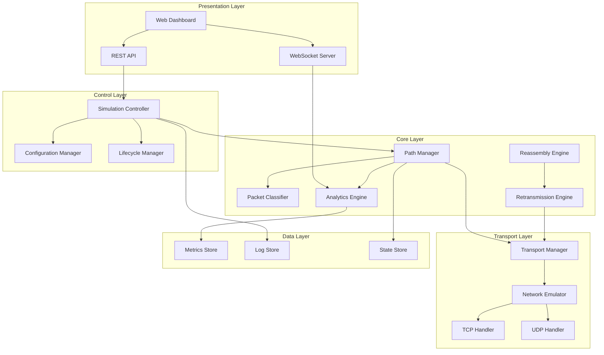
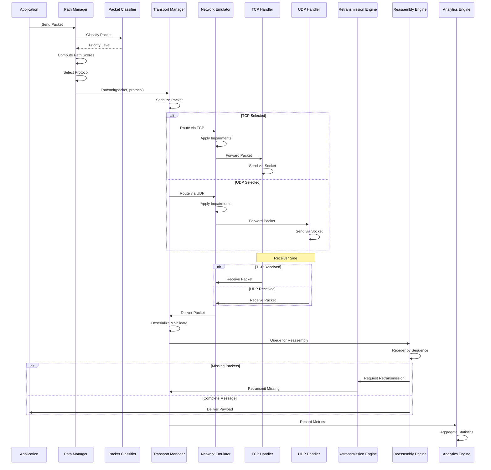
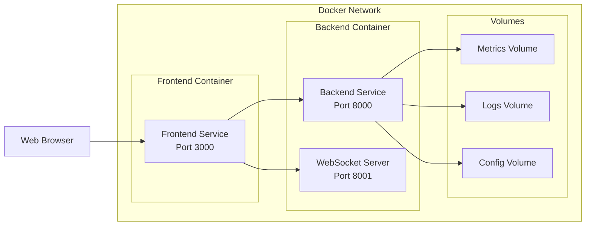

# Design Document: Hybrid Multi-Path Transport Protocol Simulator

## Overview

The Hybrid Multi-Path Transport Protocol Simulator is a production-quality distributed systems framework that demonstrates adaptive routing between TCP and UDP protocols based on real-time network conditions. The system provides a comprehensive platform for researching, demonstrating, and analyzing multi-path transport protocols in realistic network environments.

### System Purpose

This simulator serves three primary purposes:

1. **Research Platform**: Enables quantitative analysis of adaptive transport protocol behavior under various network conditions
2. **Educational Tool**: Provides visual demonstration of multi-path routing concepts for distributed systems education
3. **Portfolio Demonstration**: Showcases advanced distributed systems engineering, networking protocols, and full-stack development capabilities

### Key Capabilities

- **Hybrid Transport**: Simultaneous TCP and UDP communication with intelligent protocol selection
- **Network Emulation**: Realistic simulation of network impairments (latency, loss, jitter, congestion, reordering)
- **Adaptive Routing**: Dynamic path selection based on real-time network metrics and packet priorities
- **Reliability Layer**: Comprehensive retransmission and reassembly mechanisms
- **Real-Time Visualization**: Modern web dashboard with live metrics, topology visualization, and packet flow animation
- **Comprehensive Analytics**: Detailed performance metrics, comparative benchmarking, and statistical analysis
- **Flexible Configuration**: Scenario-based configuration system with runtime reconfiguration support

### Design Philosophy

The architecture follows these core principles:

1. **Modularity**: Clear separation of concerns with well-defined interfaces between components
2. **Extensibility**: Plugin-based architecture supporting custom routing algorithms, classifiers, and impairment models
3. **Observability**: Comprehensive structured logging and real-time metrics for debugging and analysis
4. **Performance**: Asynchronous I/O, bounded queues, and efficient metric aggregation for high packet rates
5. **Reliability**: Robust error handling, graceful degradation, and automatic recovery mechanisms

## Architecture

### High-Level Architecture

The system follows a layered architecture with clear separation between transport, control, and presentation layers:



### Component Interaction Flow



### Deployment Architecture



## Components and Interfaces

### 1. Transport Manager

**Responsibility**: Manages TCP and UDP socket connections, packet serialization/deserialization, and connection lifecycle.

**Interface**:
```python
class TransportManager:
    async def establish_tcp_connection(self, host: str, port: int) -> TCPConnection
    async def establish_udp_connection(self, host: str, port: int) -> UDPConnection
    async def transmit(self, packet: Packet, protocol: Protocol) -> TransmitResult
    async def receive(self) -> Packet
    def serialize_packet(self, packet: Packet) -> bytes
    def deserialize_packet(self, data: bytes) -> Packet
    def validate_packet(self, packet: Packet) -> ValidationResult
    async def close_connection(self, connection_id: str) -> None
```

**Key Responsibilities**:
- Socket lifecycle management (connect, disconnect, timeout handling)
- Packet serialization with checksum computation
- Packet deserialization with structure validation
- Session state maintenance
- Connection pooling and reuse

**Data Structures**:
```python
@dataclass
class Packet:
    packet_id: str
    sequence_number: int
    timestamp: float
    protocol_used: Protocol
    priority: Priority
    payload: bytes
    checksum: str
    retransmission_count: int
    path_id: str
```

### 2. Packet Classifier

**Responsibility**: Assigns priority levels to packets based on content type and application requirements.

**Interface**:
```python
class PacketClassifier:
    def classify(self, packet: Packet) -> Priority
    def register_rule(self, rule: ClassificationRule) -> None
    def get_priority_config(self, priority: Priority) -> PriorityConfig
```

**Classification Rules**:
- **CRITICAL**: Guaranteed delivery required (control messages, critical telemetry)
- **REALTIME**: Low latency required (live video, voice, sensor data)
- **BULK**: High throughput required (file transfers, batch data)
- **OPTIONAL**: Loss tolerant (non-critical logs, optional telemetry)

**Priority-to-Protocol Mapping**:
- CRITICAL → TCP preferred (reliability)
- REALTIME → UDP preferred (latency)
- BULK → Adaptive selection (throughput optimization)
- OPTIONAL → UDP fallback (minimal overhead)

### 3. Path Manager

**Responsibility**: Dynamically selects optimal transport protocol based on real-time network metrics and packet priorities.

**Interface**:
```python
class PathManager:
    async def select_path(self, packet: Packet) -> PathSelection
    async def update_metrics(self, path_id: str, metrics: PathMetrics) -> None
    def compute_path_score(self, path_id: str) -> float
    def get_path_health(self, path_id: str) -> PathHealth
    async def handle_path_failure(self, path_id: str) -> None
```

**Scoring Algorithm**:

The path score is computed using a weighted combination of network metrics:

```
score = w1 * (1 - normalized_rtt) +
        w2 * (1 - loss_rate) +
        w3 * normalized_throughput +
        w4 * (1 - normalized_jitter) +
        w5 * (1 - congestion_score)
```

Where:
- `w1, w2, w3, w4, w5` are configurable weights (default: 0.25, 0.30, 0.20, 0.15, 0.10)
- Normalization maps metrics to [0, 1] range
- Higher score indicates better path health

**Adaptive Switching Logic**:

```python
def should_switch_path(current_path: Path, alternative_path: Path) -> bool:
    # Hysteresis to prevent oscillation
    score_diff = alternative_path.score - current_path.score
    threshold = 0.15  # 15% improvement required
    
    # Switch if alternative is significantly better
    if score_diff > threshold:
        return True
    
    # Switch if current path is critically degraded
    if current_path.score < 0.3:
        return True
    
    return False
```

**Path Metrics Tracked**:
```python
@dataclass
class PathMetrics:
    rtt_ms: float
    loss_rate: float  # 0.0 to 1.0
    throughput_bps: float
    jitter_ms: float
    congestion_score: float  # 0.0 to 1.0
    packet_count: int
    retransmission_count: int
    last_updated: float
```

### 4. Network Emulator

**Responsibility**: Simulates realistic network impairments to test protocol behavior under adverse conditions.

**Interface**:
```python
class NetworkEmulator:
    async def apply_impairments(self, packet: Packet) -> EmulatorResult
    def configure(self, config: EmulatorConfig) -> None
    def inject_congestion(self, duration_ms: int, severity: float) -> None
    def get_current_conditions(self) -> NetworkConditions
```

**Impairment Models**:

1. **Latency Injection**:
   - Base latency: Configurable constant delay
   - Variable latency: Gaussian distribution with configurable mean and stddev
   - Implementation: `await asyncio.sleep(latency_seconds)`

2. **Packet Loss**:
   - Random loss: Bernoulli trial with configurable probability
   - Burst loss: Gilbert-Elliott model for correlated losses
   - Implementation: Drop packet with probability `p`

3. **Jitter**:
   - Uniform jitter: Random delay variation within range
   - Normal jitter: Gaussian distribution around mean delay
   - Implementation: `delay += random.gauss(0, jitter_stddev)`

4. **Bandwidth Throttling**:
   - Token bucket algorithm for rate limiting
   - Configurable burst size and sustained rate
   - Implementation: Token bucket with refill rate

5. **Packet Reordering**:
   - Delay buffer: Hold packets and release out of order
   - Reorder probability: Configurable percentage
   - Implementation: Delayed queue with random release

6. **Packet Duplication**:
   - Duplication probability: Configurable percentage
   - Implementation: Send packet copy with same sequence number

7. **Packet Corruption**:
   - Bit flip probability: Configurable bit error rate
   - Implementation: Flip random bits in payload, invalidate checksum

**Configuration Structure**:
```python
@dataclass
class EmulatorConfig:
    latency_ms: float = 0.0
    latency_stddev_ms: float = 0.0
    loss_rate: float = 0.0
    jitter_ms: float = 0.0
    bandwidth_mbps: float = 100.0
    reorder_probability: float = 0.0
    duplication_probability: float = 0.0
    corruption_probability: float = 0.0
    congestion_enabled: bool = False
```

### 5. Retransmission Engine

**Responsibility**: Handles packet acknowledgment, timeout detection, and retransmission logic.

**Interface**:
```python
class RetransmissionEngine:
    async def send_ack(self, packet_id: str, sequence_number: int) -> None
    async def send_nack(self, packet_id: str, sequence_number: int, reason: str) -> None
    async def handle_timeout(self, packet_id: str) -> None
    async def request_retransmission(self, missing_sequences: List[int]) -> None
    def configure_timeout(self, timeout_ms: int) -> None
```

**Retransmission Strategy**:

1. **Timeout-Based Retransmission**:
   - Adaptive timeout: `RTO = SRTT + 4 * RTTVAR` (RFC 6298)
   - Exponential backoff: Double timeout on each retry
   - Max retries: Configurable (default: 5)

2. **Selective Retransmission**:
   - Track ACKed packets in bitmap
   - Retransmit only missing packets
   - Avoid redundant retransmissions

3. **NACK-Based Recovery**:
   - Receiver sends NACK for corrupted packets
   - Immediate retransmission without timeout
   - Priority retransmission queue

**ACK/NACK Packet Format**:
```python
@dataclass
class AckPacket:
    packet_id: str
    sequence_number: int
    ack_type: AckType  # ACK or NACK
    timestamp: float
    reason: Optional[str] = None  # For NACK
```

### 6. Reassembly Engine

**Responsibility**: Reorders packets, detects missing packets, and reconstructs original payloads.

**Interface**:
```python
class ReassemblyEngine:
    async def add_packet(self, packet: Packet) -> ReassemblyResult
    def detect_missing_packets(self, message_id: str) -> List[int]
    async def reconstruct_payload(self, message_id: str) -> bytes
    def validate_checksum(self, packet: Packet) -> bool
```

**Reassembly Algorithm**:

1. **Packet Buffering**:
   - Maintain per-message buffer indexed by sequence number
   - Track expected sequence range
   - Detect gaps in sequence numbers

2. **Reordering**:
   - Sort packets by sequence number
   - Handle wraparound for large transfers
   - Maintain insertion order for same sequence

3. **Gap Detection**:
   ```python
   def detect_gaps(received_sequences: Set[int], 
                   expected_range: range) -> List[int]:
       return [seq for seq in expected_range 
               if seq not in received_sequences]
   ```

4. **Payload Reconstruction**:
   - Concatenate packet payloads in sequence order
   - Validate final checksum
   - Return complete message

**Buffer Management**:
- Bounded buffer size to prevent memory exhaustion
- Timeout-based buffer eviction for incomplete messages
- Configurable max wait time (default: 30 seconds)

### 7. Analytics Engine

**Responsibility**: Computes, aggregates, and stores performance metrics for analysis and visualization.

**Interface**:
```python
class AnalyticsEngine:
    def record_packet_sent(self, packet: Packet) -> None
    def record_packet_received(self, packet: Packet) -> None
    def record_packet_lost(self, packet: Packet) -> None
    def record_retransmission(self, packet: Packet) -> None
    def compute_metrics(self) -> SystemMetrics
    async def export_metrics(self, format: ExportFormat) -> str
```

**Metrics Computed**:

1. **Delivery Ratio**:
   ```
   delivery_ratio = (packets_delivered / packets_sent) * 100
   ```

2. **Average Latency**:
   ```
   avg_latency = sum(packet.receive_time - packet.send_time) / packets_delivered
   ```

3. **Throughput**:
   ```
   throughput = total_bytes_delivered / time_elapsed
   ```

4. **Jitter** (latency variation):
   ```
   jitter = sqrt(sum((latency_i - avg_latency)^2) / n)
   ```

5. **Protocol Utilization**:
   ```
   tcp_utilization = tcp_packets / total_packets * 100
   udp_utilization = udp_packets / total_packets * 100
   ```

6. **Efficiency Score**:
   ```
   efficiency = (delivery_ratio * 0.4) + 
                ((1 - normalized_latency) * 0.3) +
                ((1 - retransmission_ratio) * 0.3)
   ```

**Aggregation Strategy**:
- Time-series data: 1-second intervals
- Rolling windows: 10s, 60s, 300s
- Percentile tracking: p50, p95, p99 for latency
- Histogram buckets for latency distribution

**Data Structure**:
```python
@dataclass
class SystemMetrics:
    timestamp: float
    packets_sent: int
    packets_received: int
    packets_lost: int
    retransmissions: int
    delivery_ratio: float
    avg_latency_ms: float
    p50_latency_ms: float
    p95_latency_ms: float
    p99_latency_ms: float
    throughput_mbps: float
    jitter_ms: float
    tcp_utilization: float
    udp_utilization: float
    efficiency_score: float
    path_metrics: Dict[str, PathMetrics]
```

### 8. API Server

**Responsibility**: Provides REST API interface for controlling the simulator and retrieving metrics.

**Interface**:
```python
class APIServer:
    @app.post("/api/simulation/start")
    async def start_simulation(config: SimulationConfig) -> Response
    
    @app.post("/api/simulation/stop")
    async def stop_simulation() -> Response
    
    @app.put("/api/emulator/config")
    async def update_emulator_config(config: EmulatorConfig) -> Response
    
    @app.get("/api/metrics")
    async def get_metrics() -> SystemMetrics
    
    @app.put("/api/mode")
    async def switch_mode(mode: TransportMode) -> Response
    
    @app.post("/api/congestion/inject")
    async def inject_congestion(params: CongestionParams) -> Response
    
    @app.get("/api/topology")
    async def get_topology() -> TopologyState
    
    @app.post("/api/scenario/load")
    async def load_scenario(scenario_name: str) -> Response
```

**API Design Principles**:
- RESTful resource-based endpoints
- JSON request/response format
- HTTP status codes for error handling
- Request validation with Pydantic models
- Response time target: < 200ms
- Rate limiting: 100 requests/minute per client

### 9. WebSocket Server

**Responsibility**: Provides real-time bidirectional communication for live metrics and events.

**Interface**:
```python
class WebSocketServer:
    async def broadcast_metrics(self, metrics: SystemMetrics) -> None
    async def broadcast_packet_event(self, event: PacketEvent) -> None
    async def broadcast_topology_change(self, change: TopologyChange) -> None
    async def broadcast_routing_decision(self, decision: RoutingDecision) -> None
    async def broadcast_congestion_alert(self, alert: CongestionAlert) -> None
    async def send_initial_state(self, client_id: str) -> None
```

**Event Types**:
```python
@dataclass
class PacketEvent:
    event_type: str  # "sent", "received", "lost", "retransmitted"
    packet_id: str
    protocol: Protocol
    timestamp: float
    path_id: str

@dataclass
class RoutingDecision:
    packet_id: str
    selected_protocol: Protocol
    reason: str
    path_scores: Dict[str, float]
    timestamp: float

@dataclass
class CongestionAlert:
    path_id: str
    severity: float
    duration_ms: int
    timestamp: float
```

**Broadcasting Strategy**:
- Metrics: Every 1 second
- Packet events: Real-time (with batching for high rates)
- Routing decisions: Real-time
- Topology changes: Real-time
- Congestion alerts: Real-time

### 10. Frontend Architecture

**Responsibility**: Provides modern web-based dashboard for visualization and control.

**Component Structure**:
```
src/
├── components/
│   ├── Dashboard.tsx           # Main dashboard container
│   ├── TopologyView.tsx        # Network topology visualization
│   ├── PacketFlow.tsx          # Animated packet flow
│   ├── MetricsPanel.tsx        # Real-time metrics display
│   ├── LatencyChart.tsx        # Time-series latency graph
│   ├── ThroughputChart.tsx     # Time-series throughput graph
│   ├── LossChart.tsx           # Packet loss visualization
│   ├── ProtocolPieChart.tsx    # Protocol utilization
│   ├── PathHealthIndicator.tsx # Path status indicators
│   ├── SwitchingTimeline.tsx   # Protocol switching events
│   ├── ControlPanel.tsx        # Simulation controls
│   └── ConfigPanel.tsx         # Configuration interface
├── hooks/
│   ├── useWebSocket.ts         # WebSocket connection hook
│   ├── useMetrics.ts           # Metrics state management
│   └── useSimulation.ts        # Simulation control hook
├── services/
│   ├── api.ts                  # API client
│   └── websocket.ts            # WebSocket client
└── types/
    └── index.ts                # TypeScript type definitions
```

**Key Features**:
- Real-time updates via WebSocket
- Responsive design (desktop and tablet)
- Dark theme with glassmorphism effects
- Smooth animations for packet flow
- Interactive charts with zoom and pan
- Configuration hot-reload
- Export functionality for charts and data

## Data Models

### Core Data Structures

**Packet Model**:
```python
@dataclass
class Packet:
    packet_id: str              # UUID for unique identification
    sequence_number: int        # Sequence within message
    timestamp: float            # Send timestamp (Unix epoch)
    protocol_used: Protocol     # TCP or UDP
    priority: Priority          # CRITICAL, REALTIME, BULK, OPTIONAL
    payload: bytes              # Actual data
    checksum: str               # SHA-256 hash for integrity
    retransmission_count: int   # Number of retransmissions
    path_id: str                # Transport path identifier
    message_id: str             # Group packets into messages
    total_packets: int          # Total packets in message
```

**Session Model**:
```python
@dataclass
class Session:
    session_id: str
    sender_address: Tuple[str, int]
    receiver_address: Tuple[str, int]
    tcp_connection: Optional[TCPConnection]
    udp_connection: Optional[UDPConnection]
    state: SessionState  # CONNECTING, ACTIVE, CLOSING, CLOSED
    created_at: float
    last_activity: float
    packets_sent: int
    packets_received: int
```

**Path Model**:
```python
@dataclass
class Path:
    path_id: str
    protocol: Protocol
    metrics: PathMetrics
    score: float
    health: PathHealth  # HEALTHY, DEGRADED, CRITICAL, FAILED
    last_used: float
    packet_count: int
```

**Configuration Model**:
```python
@dataclass
class SimulationConfig:
    mode: TransportMode  # TCP_ONLY, UDP_ONLY, HYBRID
    sender_address: Tuple[str, int]
    receiver_address: Tuple[str, int]
    packet_rate: int  # Packets per second
    payload_size: int  # Bytes
    duration: int  # Seconds
    emulator_config: EmulatorConfig
    scenario: Optional[str]
```

### Database Schema

**Metrics Storage** (Time-Series):
```sql
CREATE TABLE metrics (
    id SERIAL PRIMARY KEY,
    timestamp TIMESTAMP NOT NULL,
    packets_sent INTEGER,
    packets_received INTEGER,
    packets_lost INTEGER,
    retransmissions INTEGER,
    delivery_ratio FLOAT,
    avg_latency_ms FLOAT,
    p50_latency_ms FLOAT,
    p95_latency_ms FLOAT,
    p99_latency_ms FLOAT,
    throughput_mbps FLOAT,
    jitter_ms FLOAT,
    tcp_utilization FLOAT,
    udp_utilization FLOAT,
    efficiency_score FLOAT
);

CREATE INDEX idx_metrics_timestamp ON metrics(timestamp);
```

**Path Metrics Storage**:
```sql
CREATE TABLE path_metrics (
    id SERIAL PRIMARY KEY,
    timestamp TIMESTAMP NOT NULL,
    path_id VARCHAR(50),
    protocol VARCHAR(10),
    rtt_ms FLOAT,
    loss_rate FLOAT,
    throughput_bps FLOAT,
    jitter_ms FLOAT,
    congestion_score FLOAT,
    health VARCHAR(20)
);

CREATE INDEX idx_path_metrics_timestamp ON path_metrics(timestamp);
CREATE INDEX idx_path_metrics_path_id ON path_metrics(path_id);
```

**Event Log Storage**:
```sql
CREATE TABLE events (
    id SERIAL PRIMARY KEY,
    timestamp TIMESTAMP NOT NULL,
    event_type VARCHAR(50),
    packet_id VARCHAR(50),
    path_id VARCHAR(50),
    protocol VARCHAR(10),
    details JSONB
);

CREATE INDEX idx_events_timestamp ON events(timestamp);
CREATE INDEX idx_events_type ON events(event_type);
```

### Serialization Format

**Binary Packet Format** (for network transmission):
```
+------------------+------------------+------------------+
| Header (64 bytes)                                      |
+------------------+------------------+------------------+
| packet_id (16)   | sequence_num (4) | timestamp (8)    |
| protocol (1)     | priority (1)     | payload_len (4)  |
| checksum (32)    | retrans_count (2)| path_id (16)     |
| message_id (16)  | total_packets (4)| reserved (8)     |
+------------------+------------------+------------------+
| Payload (variable length)                              |
+------------------+------------------+------------------+
```

**JSON Format** (for API and storage):
```json
{
  "packet_id": "550e8400-e29b-41d4-a716-446655440000",
  "sequence_number": 42,
  "timestamp": 1704067200.123456,
  "protocol_used": "TCP",
  "priority": "CRITICAL",
  "payload": "base64_encoded_data",
  "checksum": "sha256_hash",
  "retransmission_count": 0,
  "path_id": "tcp_path_1",
  "message_id": "msg_12345",
  "total_packets": 100
}
```
